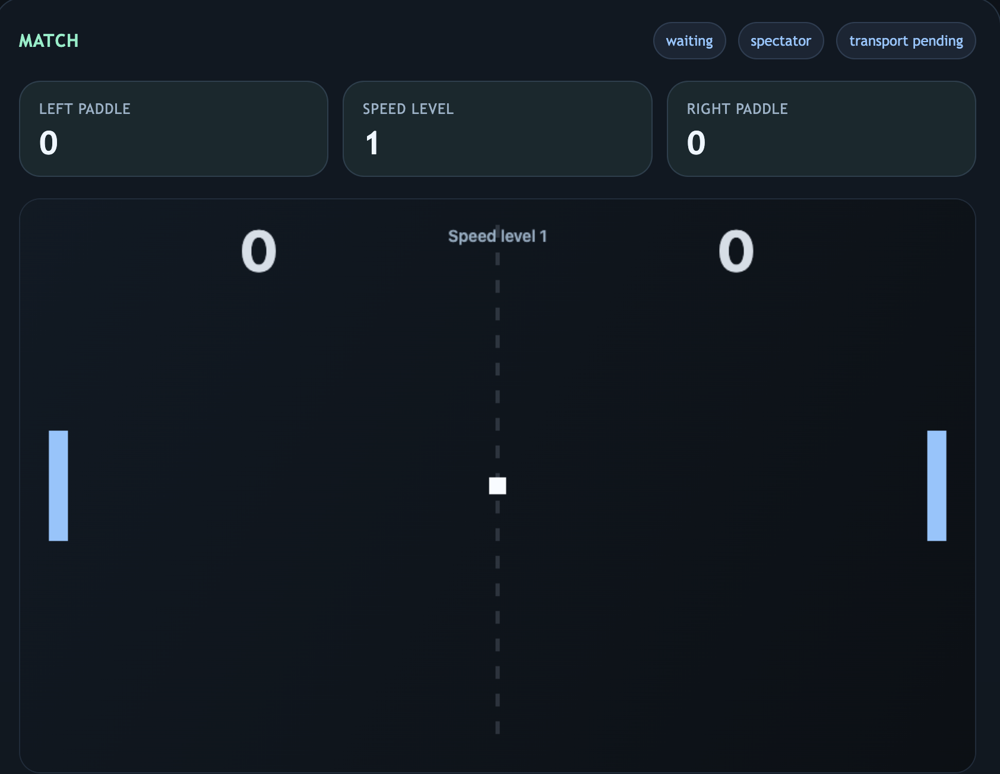

# Pong-Game-ActionScript3

<p align="center">
  
</p>

<p align="center"><strong>From the original Flash project to a modern browser-to-browser Pong experiment.</strong></p>

This repository now keeps the project split into clearly named versions:

- `flash-original-actionscript3/`: the original Flash / ActionScript 3 source files.
- `flash-converted-html5/`: the first browser-playable HTML5 / JavaScript conversion of the Flash game.
- `helia-pwa-p2p-pong/`: the newer browser-to-browser P2P Pong app built with Svelte, Helia, and libp2p.

## Project Layout

### `flash-original-actionscript3`

Original authoring assets from the Flash version:

- `Main.as`
- `PongTutorial.fla`
- `PongTutorial.swf`

Use Adobe Flash / Animate with ActionScript 3 support if you want to inspect or edit the original source.

### `flash-converted-html5`

The first web conversion of the Flash game. Open this file in a browser to play it:

```text
flash-converted-html5/index.html
```

Controls:

- `Up Arrow`: move the player paddle up
- `Down Arrow`: move the player paddle down

This version keeps the original 550x400 stage feel with the player on the left, the AI on the right, and a speed level that increases over time.

### `helia-pwa-p2p-pong`

The newer multiplayer branch with browser-to-browser networking, relay discovery, and live two-player Pong over libp2p.

See:

```text
helia-pwa-p2p-pong/README.md
```
